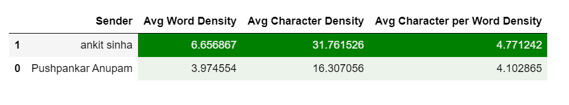

## EDA of whatsapp chat data
* Analyze summaries of WhatsApp chats with individuals or groups.
* No data is stored or sent outside your system of execution. All chat data is deleted from memory once the insights are generated. Jupyter notebooks are used so that the code generating the summaries can be viewed by the skeptical user.
* various insights can be drawn from these individual chats and look up metrics such as response time, text density, number of emojis, etc.
* have provided good visualizations using `plotly`

Some analytical information and visualiztion regarding the individual chat of one of my contact

